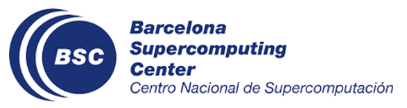
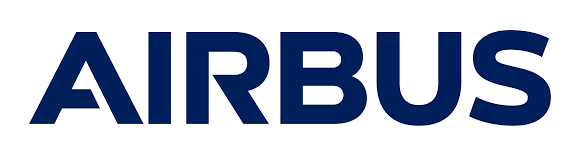

# The Vision

The RESPECT project is developing a unified framework that acilitates the development of advanced critical software targeting parallel and heterogeneous systems from two complementary points of view: (1) high-performance demands, considering productivity, portability and heterogeneity; and (2) critical demands, considering time and functional safety, maintainability and resilience.

RESPECT will reduce the time and expenses needed for the development and the verification and validation processes of parallel critical systems as required in the automotive and space sectors, among others, having a direct societal impact due to its application on smart and connected transportation systems.

# Objectives

1. Leverage the massive computational capabilities of modern parallel and heterogeneous architectures to allow the efficient development of critical software.

2. Provide evidences of the dependability of the system to facilitate the verification and validation processes.

3. Simplify and promote parallel critical software.

# Partners

 

  

   <figure>
    
    <figcaption style="max-width: 100%;">Barcelona Supercomputing Center  (Project coordinator)</figcaption>
   </figure>
  

  

   <figure>
    
    <figcaption style="max-width: 100%;">Robert Bosch GmbH  (Project mentor)</figcaption>
   </figure>
  

  

   <figure>
    
    <figcaption style="max-width: 100%;">Airbus Defence and Space  (Project mentor)</figcaption>
   </figure>
  

 

# Project description

PROJECT NAME: Reliable Heterogeneous Parallelism for Embedded Critical Systems

ACRONYM: RESPECT

FUNDING SCHEME: AGAUR Industria del Coneixement - Producte 2021

RECORD NUMBER: 2021 PROD 00179

START DATE / END DATE: 19 October 2022 / 19 April 2024

OVERALL BUDGET: €97,500

PROJECT COORDINATOR: Barcelona Supercomputing Center (BSC).

BUSINESS MENTORS: Robert Bosch GmbH (BOSCH) and Airbus Defense and Space (ADS).

[back](./)
