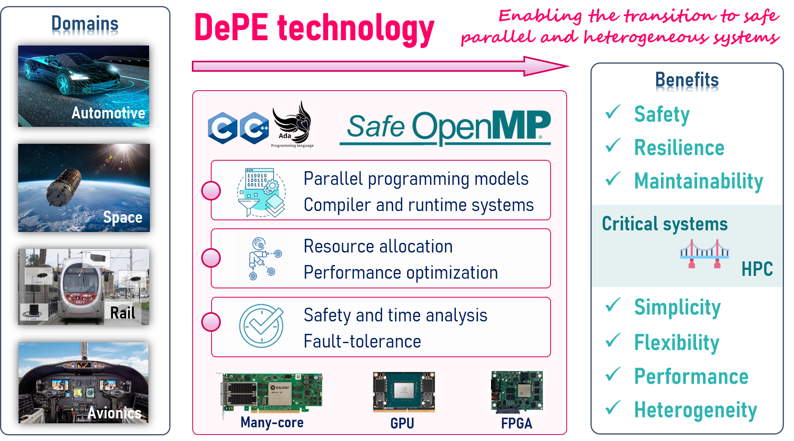

 RESPECT will integrate the software solutions needed for the development of critical embedded systems in a single tool-chain. This holistic approach allows coupling the advantages of highly-parallel and heterogeneous systems (productivity) and critical systems (dependability, focusing on safety, reliability and maintainability).

The project will develop Dependable Parallel Environment (DePE), an all-in-one tool with the next advantages over current solutions: (1) provide a correct-by-construction framework for the development of parallel applications with dependability and high-performance requirements; (2) allow a flexible and expressive way to expose the requirements of the system (i.e., safety, reliability, time and performance, including heterogeneity); (3) increase the productivity.

<figure>

<figcaption style="max-width: 100%;">DePE, the all-in-one tool for developing high-performance safety-critical systems</figcaption>
</figure>

