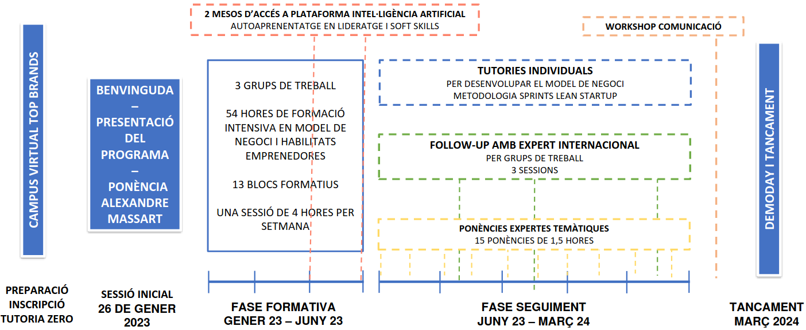

# News

  <h2>RESPECT presented in the ISC conference</h2>
  <h3>Sara Royuela, May 21, 2023</h3>
  
The RESPECT project was presented in <a href="https://www.isc-hpc.com/project-posters-2023.html">ISC-HPC</a>, one of the most important forums for the global HPC community. Researchers Adrian Munera and Sara Royuela explained the advances made in the project to apply the DePE technology to the automotive and space domains. They also participated in "The OpenMP API v5.2 and v6.0 - What's There and What's to Come..." BoF session to discuss about the future of OpenMP.

  

   <figure>
    
    <figcaption style="max-width: 100%;">The RESPECT team in ISC-HPC.</figcaption>
   </figure>
  

  <h2>The enhanced program on entrepreneurship has started</h2>
  <h3>Sara Royuela, January 19, 2023</h3>
  
As part of the grant provided by the <i>Departament de Recerca i Universitats of the Generalitat de Catalunya</i> to develop RESPECT, today has started the <a href="https://agaur.gencat.cat/web/.content/Documents/Innovacio/Formacio_emprenedoria/IdC/Formacio-emprenedoria-PROD2021.pdf"><i>enhanced program on entrepreneurship</i></a>. The purpose of this program is to help in the generation of new business models for the valuation and transfer of research results. Chenle Yu, the entrepreneur scientist of RESPECT, has attended a webinar in which different experts in business models and strategies from TopBrands have introduced the entrepreneurship program.

  

   <figure>
    
    <figcaption style="max-width: 100%;">Enhanced Entrepreneurship Program timeline.</figcaption>
   </figure>
  

  <h2>Integrating high-performance and dependability to develop complex automotive and space systems</h2>
  <h3>Sara Royuela, October 19, 2022</h3>
  
Yesterday we were notified that the RESPECT project proposal has been accepted in the <a href="https://agaur.gencat.cat/ca/beques-i-ajuts/convocatories-per-temes/02-Ajuts-dIndustria-del-Coneixement-per-a-lany-2020.-Modalitat-B.-Ajuts-Producte"><i>Ind&uacute;stria del Coneixement 2021 - Modalitat B - Ajuts Producte</i></a>. We thank the <i>Departament de Recerca i Universitats of the Generalitat de Catalunya</i> for this opportunity, and really value the grades obtained in the selection process (6.83/7).

  
The project will be lead and developed by the Barcelona Supercomputing Center (BSC), with the mentoring of two top companies from the automotive and the space sectors, which are Robert Bosch GmbH (BOSCH) and Airbus Defence and Space (ADS). The RESPECT team is formed by 6 members:

  <ul>
    <li>Sara Royuela (BSC), the responsible scientist.</li>
    <li>Chenle Yu (BSC), the entrepreneur scientist.</li>
    <li>Eduardo Quiñones (BSC), the technical expert.</li>
    <li>Adrian Munera (BSC), the research engineer.</li>
    <li>Dirk Ziegenbein (BOSCH), the mentor from the automotive domain.</li>
    <li>Franck Wartel (ADS), the mentor from the space domain.</li>
  </ul>
  
The RESPECT project will bring DePE, our technology for high-performance critical systems, from TRL 4 to TRL 5/6. The technology has been growing since 2016, with the funding of previous projects, like <a href="https://ampere-euproject.eu">AMPERE</a> and <a href="https://zenodo.org/record/5639503/files/05.01_OBDP2021_Certain.pdf">HP4S</a>. With RESPECT, DePE will be further enhanced with resilience and productivity features to efficiently and safely exploit parallel and heterogeneous systems. Furthermore, DePE will be tested in relevant scenarios of the automotive and the space domains.

  
The project starts tomorrow! Keep tuned, we will be adding content soon!

[back](./)
